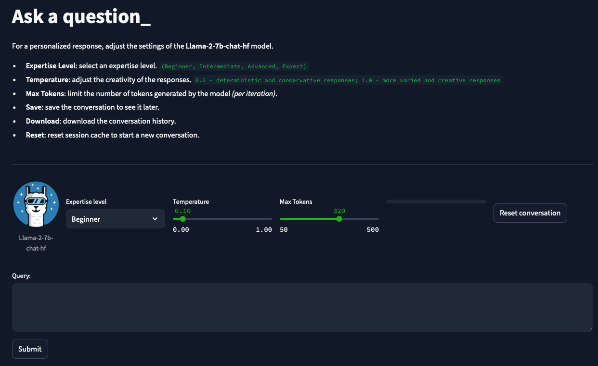
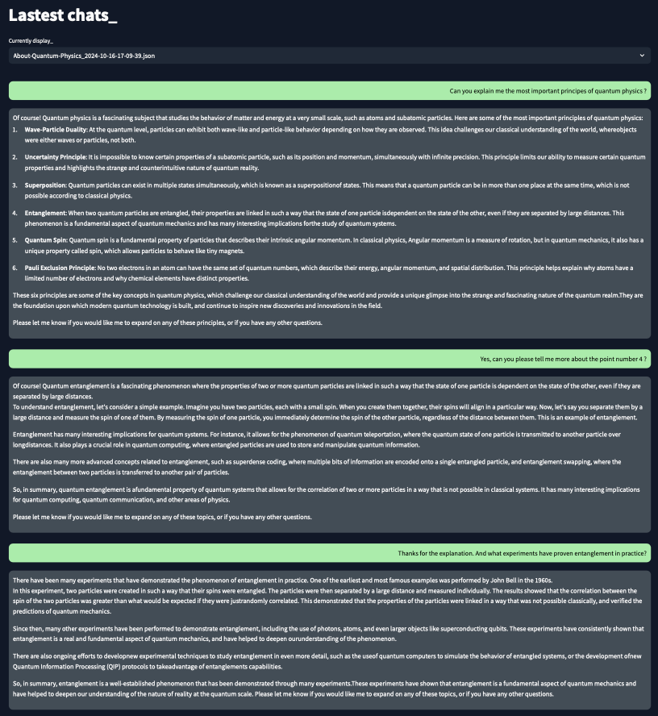

# Quantum Insights ⚡️

Welcome to **Quantum Insights**, a research assistant designed to **simplify access to cutting-edge research** in quantum physics. This project leverages **LLMs (Large Language Models)** to synthesize, summarize and explain complex scientific papers, making them accessible to everyone—whether you're a seasoned scientist or just starting out.



> For the moment, you have to use your proper 'Pro Hugging Face API Key' to run the application. 
> You can get one by signing up on the Hugging Face website, the key should be placed in the `src/app/.env` file.

> Project is still in development, stay tuned for the next updates ! 😉
---
## Key Features

- **Research Summaries**: Extract key information from **ArXiv** papers. 
- **Concept Explanation**: Break down complex scientific topics into simple, digestible concepts.
- **Code Extraction**: Identify and explain code snippets from research papers.
- **Multilevel Support**: Adjust research papers explanation level to reach a global audience.

### Example Usage



---

## Stack 

1. **Arxiv API Integration**: Search and fetch the latest papers from ArXiv's extensive database.
2. **Document Processing**: Structure detection with **SpaCy** `en_core_web_sm` and sentiment analysis using **DistilBERT** [[Model card](https://huggingface.co/distilbert-base-uncased)].
3. **Embeddings**: Generate document embeddings with **sentence-transformers** `all-MiniLM-L6-v2` [[Model card](https://huggingface.co/sentence-transformers/all-MiniLM-L6-v2)].
4. **Vector Storage**: Persistently store document embeddings using **ChromaDB**.
5. **RAG System**: Implement **Retrieval-Augmented Generation** to retrieve relevant documents via ChromaDB.
6. **Text Generation**: Utilize **LLaMA 2** (`Llama-2-7b-chat-hf`) for text-to-text generation [[Model card](https://huggingface.co/meta-llama/Llama-2-7b-chat-hf)].
7. **Streamlit UI**: User interface with **Streamlit** for seamless interaction.
8. **CI/CD**: Testing and deployment using **GitHub Actions** and **Docker**.
9. **Cloud Deployment**: Application deployment on **AWS**.
---

## Why Use This Project?

Whether you’re a **scientist**, **industry professional**, or **beginner**, this project empowers you to dive deep into the latest breakthroughs in quantum research. You’ll be able to search, summarize, and explore complex topics without the typical technical barriers. The integration of modern NLP ensure an efficient and user-friendly experience.

Get started today and bridge the gap between research and innovation! 🌐

---

## Table of Contents

- [Installation](#installation)
- [Usage](#usage)
- [Project Structure](#project-structure)
- [License](#license)

## Prerequisites

Before you begin, ensure you have the following software installed on your system:

- **Python 3.10+**: This project uses Python, so you'll need to have Python installed. You can download it from [python.org](https://www.python.org/).
- **Poetry**: This project uses Poetry for dependency management. Install it by following the instructions at [python-poetry.org](https://python-poetry.org/docs/#installation).
- **Docker** (Optional): If you prefer to run the project in a Docker container, ensure Docker is installed. Instructions can be found at [docker.com](https://www.docker.com/).

---

## Installation

Follow these steps to install and set up the project:

1. **Clone the Repository:**

   ```bash
   git clone https://github.com/mriusero/projet-sda-mlops
   cd projet-sda-mlops
   ```

2. **Install Dependencies:**

   Using Poetry:

   ```bash
   poetry install
   ```

   This will create a virtual environment and install all dependencies listed in `pyproject.toml`.

3. **Activate the Virtual Environment:**

   If Poetry does not automatically activate the virtual environment, you can activate it manually:

   ```bash
   poetry shell
   ```
---
## Usage

You can run the application locally or inside a Docker container.

### Running Locally

To run the application locally, execute the following command:

```bash
python streamlit run app.py
```

### Running with Docker

1. **Build the Docker Image:**

   ```bash
   docker build -t streamlit .
   ```

2. **Run the Docker Container:**

   ```bash
   docker run -p 8501:8501 streamlit
   ```
   
   This will start the application, and you can access it in your web browser at `http://localhost:8501`.
---
## Project Structure

The project follows a modular structure, with the following directories and files:

```
├── Dockerfile
├── LICENSE
├── README.md
├── app.py
├── database
│   ├── arxiv_data.db
│   └── conversations
│       ├── About-Quantum-Physics_2024-10-16-17-09-39.json
│       ├── Code-Algorithms_2024-10-16-17-21-50.json
│       ├── Industrial-Applications_2024-10-16-17-33-34.json
│       ├── Mathematics_2024-10-16-17-29-38.json
│       └── Quantum-Discoveries_2024-10-16-17-38-32.json
├── poetry.lock
├── pyproject.toml
├── src
│   ├── __init__.py
│   └── app
│       ├── __init__.py
│       ├── components
│       │   ├── __init__.py
│       │   ├── repo_button.py
│       │   └── utils.py
│       ├── features
│       │   ├── __init__.py
│       │   ├── arxiv_data_manager
│       │   │   ├── __init__.py
│       │   │   ├── arxiv_client.py
│       │   │   ├── arxiv_db.py
│       │   │   ├── arxiv_parser.py
│       │   │   └── search_and_update.py
│       │   └── research_assistant
│       │      ├── __init__.py
│       │      ├── checkpoints
│       │      │   └── processed_pdfs.pkl
│       │      ├── processing
│       │      │   ├── __init__.py
│       │      │   ├── preprocessing.py
│       │      │   ├── preprocessor.py
│       │      │   └── store_manager.py
│       │      ├── qa_system
│       │      │   ├── __init__.py
│       │      │   ├── conversation_saving.py
│       │      │   ├── conversation_ui.py
│       │      │   ├── qa_helper.py
│       │      │   └── qa_system.py
│       │      ├── skeleton.py
│       │      └── utilities
│       │          ├── __init__.py
│       │          └── helper.py
│       ├── layout
│       │   ├── __init__.py
│       │   ├── images
│       │   │   └── llama-icon.png
│       │   ├── layout0.py
│       │   ├── layout1.py
│       │   ├── layout2.py
│       │   ├── layout3.py
│       ├── streamlit_app.py
│       └── styles.css
└── tests
    └── test.py
```
---
## License
This project is licensed under the terms of the [MIT License](LICENSE).
